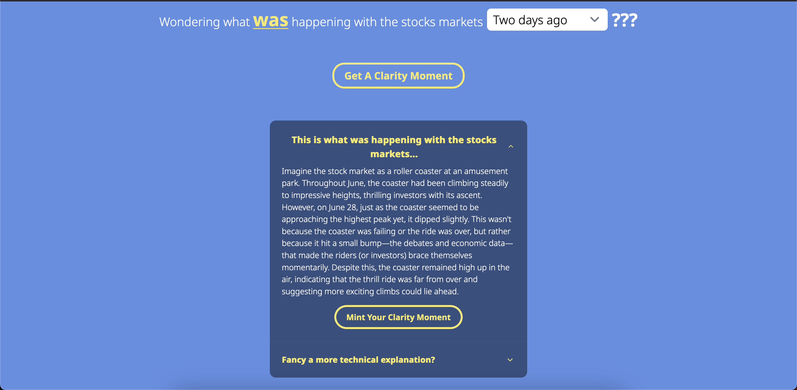
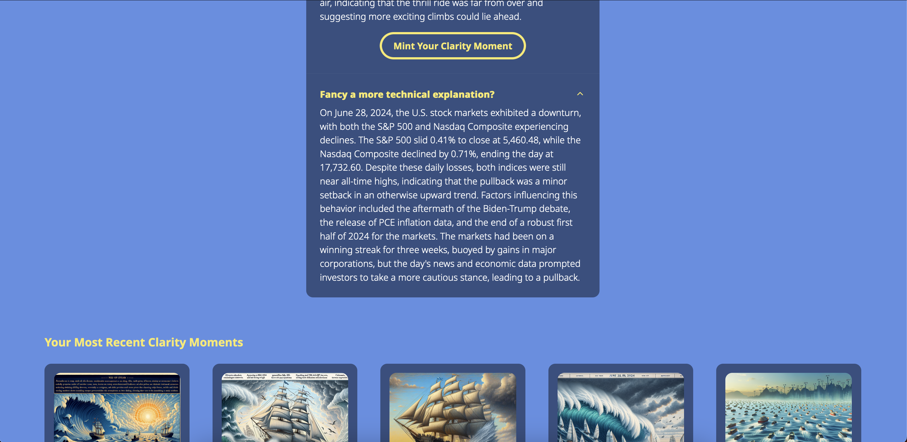
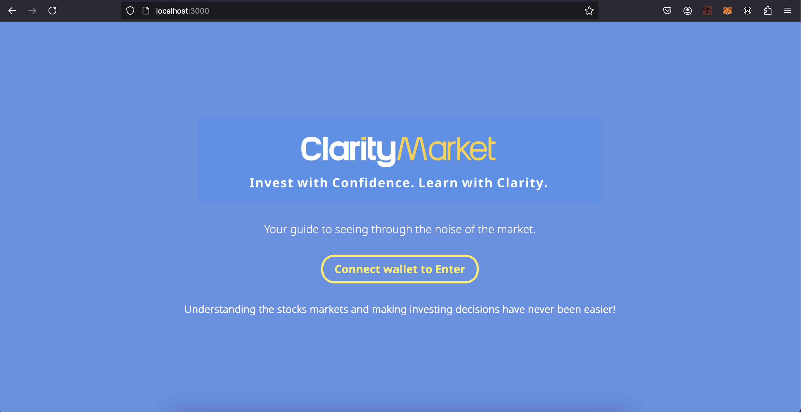
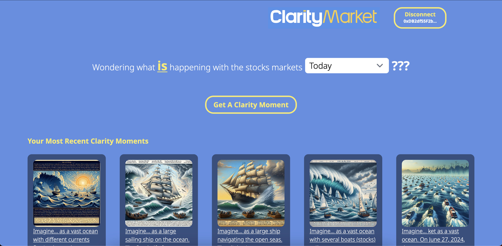
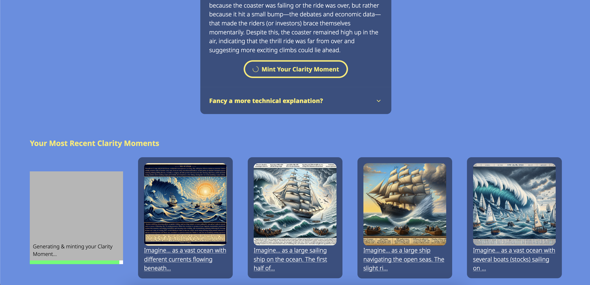
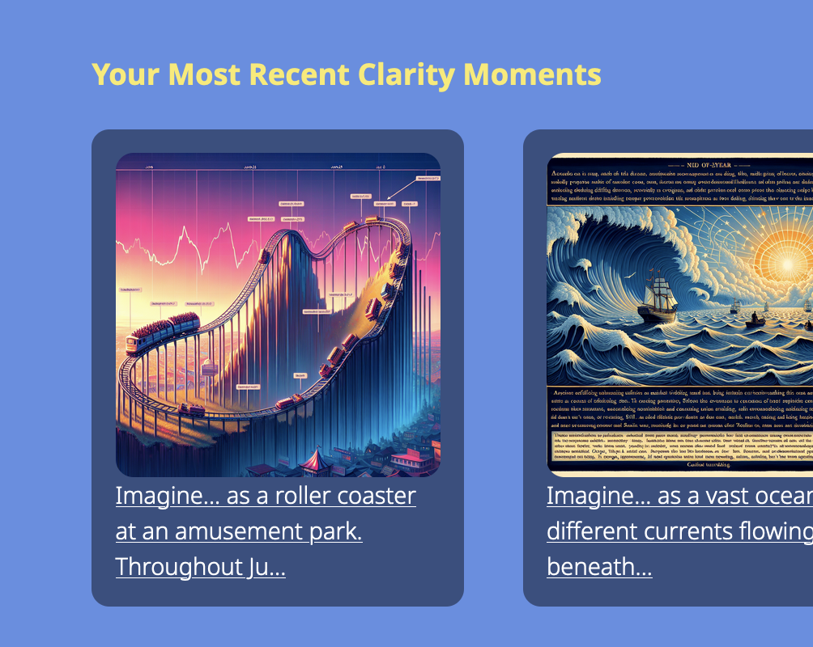

**Demo**: [Click here..](https://clarity-market.vercel.app/)

# ClarityMarket
We're excited to introduce ClarityMarket: Your guide to seeing through the noise of the market.

## Project Overview

ClarityMarket is a revolutionary financial educational platform designed to empower retail investors.

## The Problem

The stock market can be a daunting place for new investors, with complex terminology and unpredictable fluctuations. Many individuals are hesitant to invest because of the perceived risk and lack of clear educational resources. There are three main challenges retail investors face nowadays:
1. **The first and most important one is losing money with every single invesment**: A significant proportion of retail investors navigate choppy waters. With a range of 69% to 84% facing losses, it’s evident that retail investing, while offering potential rewards, carries substantial risks.
2. **The stock markets have high volatility and complexity**: Such pronounced loss percentages highlight the unpredictable nature of the market and the steep learning curve many individual investors face.
3. **Most retail investors lack financial literacy and risk management**: Given the high rate of losses among retail investors, there’s an imperative need for enhanced financial education, robust risk-management tools, and informed decision-making in the retail investment arena. 
[Source](https://www.onlinedasher.com/retail-investor-statistics/)

## Solution

We aim to address all those challanges with ClarityMarket, a platform that breaks down investment barriers by:

1. **Providing easy-to-understand explanations**: We've avoided jargon and focused on clear, concise and engaging language to make investing accessible for everyone, regardless of their financial literacy. However, we also provide an alternative more technical explanation for helping the users get used to financial technicalites and terms.

2. **Simplifying the user interface**: We're designing a clean and intuitive interface that makes it easy to understand how the market is performing and why.

3. **Making financial analysis COOL and VISUAL**: We also offer the user the chance to Mint a cool NFT with the explanation the app is giving, so he could keep track of the markets on a cool and visual way.

## Why we built ClarityMarket?

We believe in empowering people to take control of their finances, and that everyone should have the opporutnity to grow his/her wealth.

## Key Features

1. **Clear & Concise Investment Data**: Provides real-time and historical stock information in a user-friendly, understandable format, perfect for beginners.

2. **Intuitive User Interface**: Easy-to-navigate interface, regardless of your experience. Designed to be easy to use for non-experts.

3. **"Market for Everyone" Approach**: Simplifies the complexities of stock market analysis.

4. **Accessible Educational Tools**: Simplifies the complex world of finance, making it easier for everyone to understand.

## Roadmap

1. **Working prototype**: In this prototype we decided to just allow the analysis of up to three days of stocks markets information. Additionally, we currently do a basic web search in order to get the most relevant news on a specific date. The image generation was implemented also using a tool from the GenAI agent.
2. **MVP**: We are planning to add more features in the following months: Adding a larger context with up to 2 weeks of search data, Making more complex web searches through a more elaborated function calling scheme, Adding tokenomics to the app's logic in order to develop a profitable and sustainable business, Adding more capabilities to the NFT feature including social sharing.
3. **Mainnet**: We would love to be able to take the MVP to Galabriel's mainnet once is available to the public.
4. **Stock tracking & Investing**: By the end of the year, we will be adding individual stocks tracking and investing capabilities to the app, so investors would be able to put the knowledge they are getting from the app to work and make some money.

## Contributors
- **Fredy D.**: aka [Dev bambino](https://github.com/devbambino), Full Stack Dev.

## Technology

### AI + Blockchain with Galadriel

Thanks to Galadriel L1, this app was able to implement a GenAI agent that helps the retail investors understand what is happening wih the stocks markets.

Using Galadriel's blockchain and libraries, we were able to implement a text-generation agent that is making a real time web search, and a image-generation agent for generating the NFT with the market insights.

### Frontend

As a starting point for our app we decided to use the "example-generative-nft-minter" repository, and build our app on top of it. Thanks to that we were able to develop our really cool app in just a couple of days, just on time for submitting to the Encode hackathon.

For running the app, check the README file inside the "front" folder on this repository for the instructions.

### Contracts

We are using the agent.sol and dalleNFT.sol contracts provided by the Galadriel team, with almost no additional change. The contracts were deployed here:

1. **Market Insight Agent Contract**:
https://explorer.galadriel.com/address/0x8cd76C26B5648AC93edd374921034d219eb2B86C

2. **Image Generation Contract**:
https://explorer.galadriel.com/address/0x4c5ABe93a48986822c5cdD221985ee2Ab961e4F1

## Special Thanks

We want to congratulate the Galadriel team for the amazing job they have done with their L1. It is really easy to use. Besides, the documentation is easy to follow and the demo samples work like a charm. We are now Galadriel fans, and we are looking forward to continue building apps on their chain.